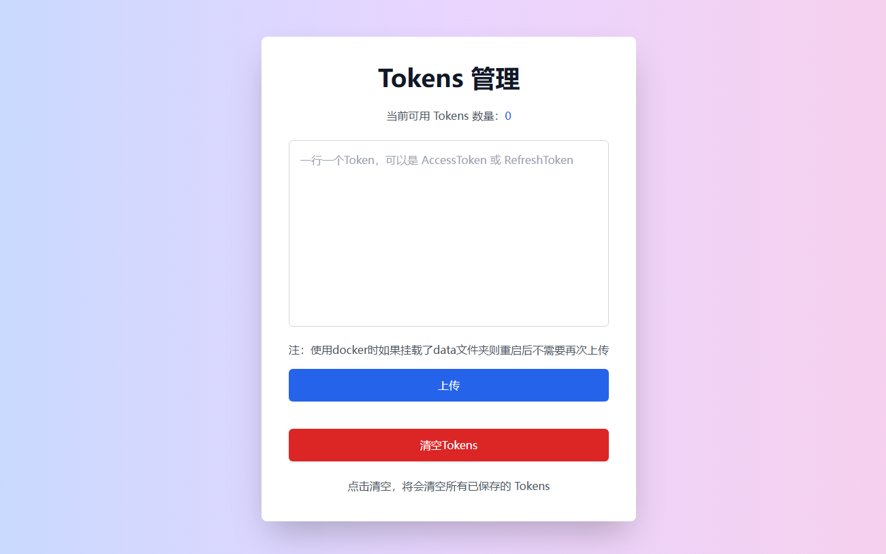

# CHAT2API

🤖 一个简单的 ChatGPT TO API 代理

🌟 无需账号即可使用免费、无限的 `GPT-3.5`

💥 支持 AccessToken 使用账号，支持 `GPT-4`、`GPT-4o`、 `GPTs`

🔍 回复格式与真实 API 完全一致，适配几乎所有客户端

## 交流群

[https://t.me/chat2api](https://t.me/chat2api)

要提问请先阅读完仓库文档，尤其是常见问题部分。

提问时请提供：

1. 启动日志截图（敏感信息打码，包括环境变量和版本号）
2. 报错的日志信息（敏感信息打码）
3. 接口返回的状态码和响应体

## 功能

### 最新版 v1.3.1

> 已完成
> - [x] 流式、非流式传输
> - [x] 免登录 GPT-3.5 对话
> - [x] GPT-3.5 对话（传入模型名不包含 gpt-4，则默认使用 gpt-3.5，也就是 text-davinci-002-render-sha）
> - [x] GPT-4 对话（传入模型名包含: gpt-4，gpt-4o，gpt-4-moblie 即可使用对应模型，需传入 AccessToken）
> - [x] GPT-4 画图、代码、联网
> - [x] 支持 GPTs（传入模型名：gpt-4-gizmo-g-*）
> - [x] 支持 Team Plus 账号（需传入 team account id）
> - [x] 上传图片、文件（格式为 API 对应格式，支持 URL 和 base64）
> - [x] WebUI（[http://127.0.0.1:5005](http://127.0.0.1:5005)，不支持登录使用, 网关副产品，因此不做维护）
> - [x] 可作为网关使用，可多机分布部署
> - [x] 多账号轮询，同时支持 AccessToken 和 RefreshToken
> - [x] 请求失败重试，自动轮询下一个 Token
> - [x] Tokens 管理，支持上传、清除
> - [x] 定时使用 RefreshToken 刷新 AccessToken / 每次启动将会全部非强制刷新一次，每4天晚上3点全部强制刷新一次。
> - [x] 支持文件下载，需要开启历史记录

> TODO
> - [ ] 暂无，欢迎提 issue

## Tokens 管理

首先配置环境变量 `AUTHORIZATION`，然后运行程序。

访问 `/tokens` 或者 `/api_prefix/tokens` 可以查看现有 Tokens 数量，也可以上传新的 Tokens ，或者清空 Tokens。

请求时传入 `AUTHORIZATION` 中你配置的值即可多账号轮询， `AUTHORIZATION` 可以配置多个值，用英文逗号分隔。



## 环境变量

每个环境变量都有默认值，如果不懂环境变量的含义，请不要设置，更不要传空值，字符串无需引号。

| 分类   | 变量名               | 示例值                                                         | 默认值                   | 描述                                                           |
|------|-------------------|-------------------------------------------------------------|-----------------------|--------------------------------------------------------------|
| 安全相关 | API_PREFIX        | `your_prefix`                                               | `None`                | API 前缀密码，不设置容易被人访问，设置后需请求 `/your_prefix/v1/chat/completions` |
|      | AUTHORIZATION     | `your_first_authorization`,<br/>`your_second_authorization` | `[]`                  | 你自己为使用多账号轮询 Tokens 设置的授权，英文逗号分隔                              |
|      | AUTH_KEY          | `your_auth_key`                                             | `None`                | 私人网关需要加`auth_key`请求头才设置该项                                    |
| 请求相关 | CHATGPT_BASE_URL  | `https://chatgpt.com`                                       | `https://chatgpt.com` | ChatGPT 网关地址，设置后会改变请求的网站，多个网关用逗号分隔                           |
|      | PROXY_URL         | `http://ip:port`,<br/>`http://username:password@ip:port`    | `[]`                  | 全局代理 URL，出 403 时启用，多个代理用逗号分隔                                 |
|      | EXPORT_PROXY_URL  | `http://ip:port`或<br/>`http://username:password@ip:port`    | `None`                | 出口代理 URL，防止请求图片和文件时泄漏源站 ip                                   |
|      | ARKOSE_TOKEN_URL  | `https://example.com/token`                                 | `[]`                  | 获取 Arkose token 的地址                                          |
| 功能相关 | HISTORY_DISABLED  | `true`                                                      | `true`                | 是否不保存聊天记录并返回 conversation_id                                 |
|      | POW_DIFFICULTY    | `00003a`                                                    | `00003a`              | 要解决的工作量证明难度，不懂别设置                                            |
|      | RETRY_TIMES       | `3`                                                         | `3`                   | 出错重试次数，使用 AUTHORIZATION 会自动轮询下一个账号                           |
|      | ENABLE_GATEWAY    | `true`                                                      | `true`                | 是否启用网关模式（WEBUI）                                              |
|      | CONVERSATION_ONLY | `false`                                                     | `false`               | 是否直接使用对话接口，如果你用的网关支持自动解决pow和arkose才启用                        |
|      | ENABLE_LIMIT      | `true`                                                      | `true`                | 开启后不尝试突破官方次数限制，尽可能防止封号                                       |
|      | UPLOAD_BY_URL     | `false`                                                     | `false`               | 开启后按照 `URL+空格+正文` 进行对话，自动解析 URL 内容并上传，多个 URL 用空格分隔           |
|      | CHECK_MODEL       | `false`                                                     | `false`               | 检查账号是否支持传入模型，开启后可以稍微避免4o返回3.5内容，但是会增加请求时延，且并不能解决降智问题         |
|      | SCHEDULED_REFRESH | `false`                                                     | `false`               | 是否定时刷新 AccessToken ，开启后每次启动程序将会全部非强制刷新一次，每4天晚上3点全部强制刷新一次。    |

## 部署

### Zeabur 部署

[](https://zeabur.com/templates/6HEGIZ?referralCode=LanQian528)

### 直接部署

```bash
git clone https://github.com/LanQian528/chat2api
cd chat2api
pip install -r requirements.txt
python app.py
```

### Docker 部署

您需要安装 Docker 和 Docker Compose。

```bash
docker run -d \
  --name chat2api \
  -p 5005:5005 \
  lanqian528/chat2api:latest
```

### (推荐，可用 PLUS 账号) Docker Compose 部署

创建一个新的目录，例如 chat2api，并进入该目录：

```bash
mkdir chat2api
cd chat2api
```

在此目录中下载库中的 docker-compose.yml 文件：

```bash
wget https://raw.githubusercontent.com/LanQian528/chat2api/main/docker-compose.yml
```

修改 docker-compose.yml 文件中的环境变量，保存后：

```bash
docker-compose up -d
```

## 使用

1. 在网页使用，直接访问以下地址，仅支持使用免登 GPT-3.5：

```
http://127.0.0.1:5005
```

2. 使用 API ，支持传入 AccessToken 或 RefreshToken，可用 GPT-4, GPT-4o, GPTs：

```bash
curl --location 'http://127.0.0.1:5005/v1/chat/completions' \
--header 'Content-Type: application/json' \
--header 'Authorization: Bearer {{OpenAI APIKEY}}' \
--data '{
     "model": "gpt-3.5-turbo",
     "messages": [{"role": "user", "content": "Say this is a test!"}],
     "stream": true
   }'
```

将你账号的 `AccessToken` 或 `RefreshToken` 当作 `OpenAI APIKEY` 传入。

如果有team账号，可以传入 `ChatGPT-Account-ID`，使用 Team 工作区：

- 传入方式一：
`headers` 中传入 `ChatGPT-Account-ID`值

- 传入方式二：
`Authorization: Bearer <AccessToken 或 RefreshToken>,<ChatGPT-Account-ID>`

如果设置了 `AUTHORIZATION` 环境变量，可以将设置的值当作 `OpenAI APIKEY` 传入进行多 Tokens 轮询。

> - `AccessToken` 获取: chatgpt官网登录后，再打开 [https://chatgpt.com/api/auth/session](https://chatgpt.com/api/auth/session) 获取 `accessToken` 这个值。
> - `RefreshToken` 获取: 此处不提供获取方法。
> - 免登录 gpt-3.5 无需传入 Token。

## ArkoseToken

> #### 目前支持外部服务提供 ArkoseToken
>
> #### 推荐使用 docker-compose 方式部署，已内置 Arkose 服务

1. 设置环境变量 `ARKOSE_TOKEN_URL`

2. 在需要 `ArkoseToken` 的时候，`chat2api` 会向 `ARKOSE_TOKEN_URL` 发送 `POST` 请求

3. 请按照以下格式提供外部服务：

- 请求体：

```json
{"blob": "rFYaxQNEApDlx/Db.KyrE79pAAFBs70CYtbM4pMNUsc7jIkLGdiDs7vziHRGe78bqWXDo0AYyq2A10qIlcTt89lBYXJqCbONC/nD8C199pEZ/c9ocVKKtM27jZQ7fyOpWd9p5qjKeXT4xEGBFpoE3Re1DwdQeijYp7VMJQyw7RYN+IDB1QEx3aKSO6aTI+ivnhw9ztfn/p1SkvAyyOhur/ArF08WQ+rXQpxpttaSQlzMsIwlYbuUUuYE2f9JrQaYG7qip1DKvju111P6wTNy4QVlMXG32VrzaOWh4nmQ0lOcZ1DmN6u2aeJZotffHV2zOOQAqqnParidTbN+qFre2t77ZwBuGKGqLyT8LeOp02GdFwcyw0kkeX+L7vwYAzBpjA5ky0r0X+i8HpzWt8QCyWzEW9kHn9LLCTwg2MOumzjb66Ad4WDe+C1bAcOKuEyXiYh+a1cWZAOdzEuxEg90yCfI7DZR94BsoDR85gEC/Og88i098u5HV7hZZEOQ6J8fmi68FSyPkN7oLCmBsZCMAZqzapNP/MkeIMExrdw7Jf/PtMrZN4bwM56mWfyIJf5h/zXu8PUajVwE9Pj/M5VtB0spZg49JNeHExosVCAB0C0JW+T8vEIwoqiY4pRQ0lbMHTQZFpU2xURTgcgh+m6g1SEYR1FY3de1XnzfiTQq1RTNJPydj5xpt6r6okr8yIJdRhmVXlQI+pS7vi3+Lls2hnpr7L+l1mcUIMPZNBCs3AUFJNpp6SwQjZkPvKggg1p+uS6PdvKRizM9O9+FKc103AhuSia8KTrvU8tWhBhCzIHCD4LNfnkjuBWSdbDttva4AEXUoPuKkQCWaBzq4lQPUIHFOM9HmNe738vVkNdAuOYffxDNegcpIxLVgZGfbgLQ="}
```

- 响应体：

```json
{"token": "45017c7bb17115f36.7290869304|r=ap-southeast-1|meta=3|metabgclr=transparent|metaiconclr=%23757575|guitextcolor=%23000000|pk=0A1D34FC-659D-4E23-B17B-694DCFCF6A6C|at=40|sup=1|rid=3|ag=101|cdn_url=https%3A%2F%2Ftcr9i.openai.com%2Fcdn%2Ffc|lurl=https%3A%2F%2Faudio-ap-southeast-1.arkoselabs.com|surl=https%3A%2F%2Ftcr9i.openai.com|smurl=https%3A%2F%2Ftcr9i.openai.com%2Fcdn%2Ffc%2Fassets%2Fstyle-manager"}
```

## 常见问题

> - 错误代码：
>   - `401`：当前 IP 不支持免登录，请尝试更换 IP 地址，或者在环境变量 `PROXY_URL` 中设置代理，或者你的身份验证失败。
>   - `403`：请在日志中查看具体报错信息。
>   - `429`：当前 IP 请求1小时内请求超过限制，请稍后再试，或更换 IP。
>   - `500`：服务器内部错误，请求失败。
>   - `502`：服务器网关错误，或网络不可用，请尝试更换网络环境。

> - 已知情况：
>   - 日本 IP 很多不支持免登，免登 GPT-3.5 建议使用美国 IP。
>   - 99%的账号都支持免费 `GPT-4o` ，但根据 IP 地区开启，目前日本和新加坡 IP 已知开启概率较大。

> - 环境变量 `AUTHORIZATION` 是什么？
>   - 是一个自己给 chat2api 设置的一个身份验证，设置后才可使用已保存的 Tokens 轮询，请求时当作 `APIKEY` 传入。
> - AccessToken 如何获取？
>   - chatgpt官网登录后，再打开 [https://chatgpt.com/api/auth/session](https://chatgpt.com/api/auth/session) 获取 `accessToken` 这个值。
> - PLUS 账号报错 `403`？
>   - PLUS 账号需要配置 `ArkoseToken`，请根据上文进行配置。
> - ArkoseToken 是什么，怎么获取？
>   - 请参考上文的说明，更多请参考 [https://www.arkoselabs.com/](https://www.arkoselabs.com/)

## 赞助商

[](https://capsolver.com/?utm_source=github&utm_medium=github_banner&utm_campaign=chat2api)

## License

MIT License

